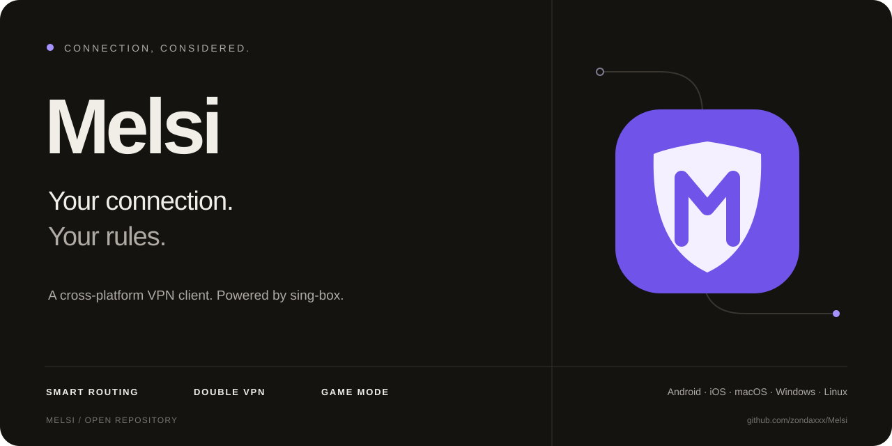
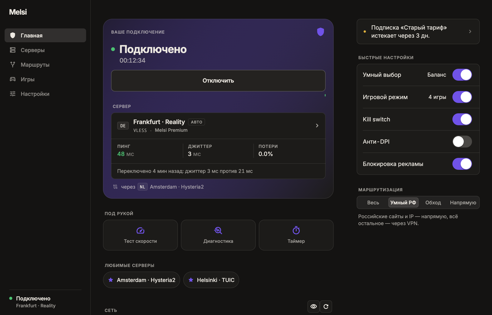
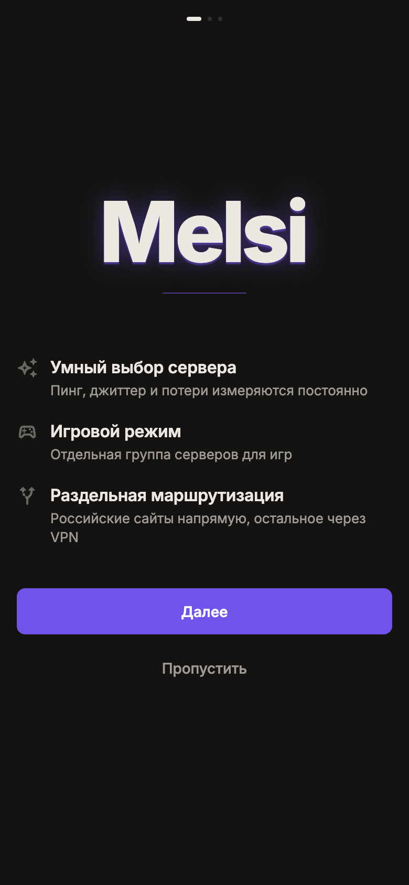
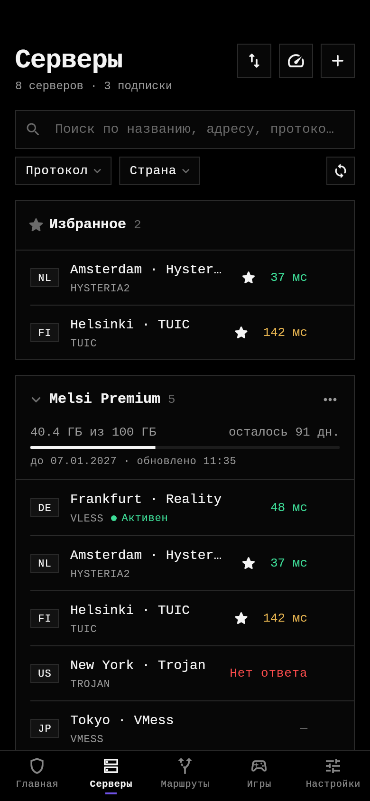
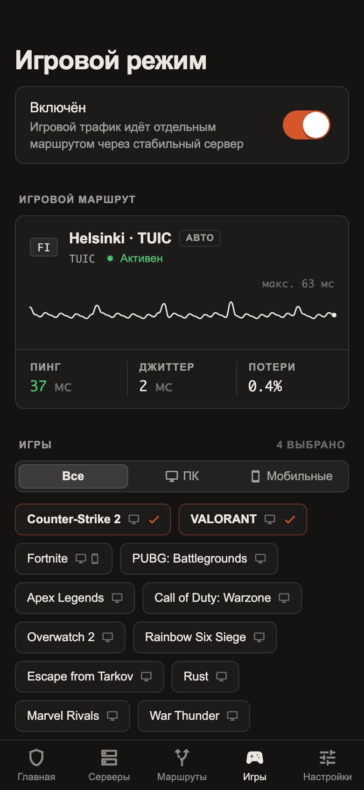

<p align="center">
  
</p>

<p align="center">
  <a href="https://github.com/zondaxxx/Melsi/releases"></a>
  <a href="https://github.com/zondaxxx/Melsi/actions/workflows/build.yml"></a>
  
  
</p>

<p align="center">
  <a href="https://github.com/zondaxxx/Melsi/releases"><strong>Скачать</strong></a> ·
  <a href="#возможности">Возможности</a> ·
  <a href="CHANGELOG.md">Что нового</a> ·
  <a href="https://github.com/zondaxxx/Melsi/issues">Сообщить об ошибке</a>
</p>

# Melsi — подключение по вашим правилам

Кроссплатформенный VPN-клиент на ядре [sing-box](https://github.com/SagerNet/sing-box) 1.14. Умный выбор сервера, игровой режим и раздельная маршрутизация — в спокойном интерфейсе без лишнего шума.

**Melsi — клиент, а не VPN-провайдер.** Для подключения нужна собственная ссылка на сервер или подписка. Публичные предварительные сборки предназначены для тестирования; проверка соединений на реальных устройствах ещё продолжается.

## Скачать и подключиться

Выберите файл в [GitHub Releases](https://github.com/zondaxxx/Melsi/releases). Контрольные суммы находятся рядом, в `SHA256SUMS.txt`.

| Платформа | Что скачать | Перед установкой |
| --- | --- | --- |
| Android | `android-arm64-v8a.apk` или `android-universal.apk` | При отсутствии релизного ключа сборки подписаны отладочным ключом |
| macOS | `macos-universal.dmg` | Apple Silicon и Intel; без Developer ID подпись ad-hoc, возможен запрос Gatekeeper |
| Windows | `windows-x64-setup.exe` или `portable.zip` | x64; для TUN нужны права администратора |
| Linux | `.deb`, `.tar.gz` или `.AppImage` | x64; AppImage публикуется при успешной упаковке |
| iOS | `ios-unsigned.ipa` | Только для переподписи командой с правом Network Extension; напрямую не устанавливается |

1. Установите клиент и пройдите короткое приветствие.
2. Добавьте ссылку или подписку: из буфера, QR-кода либо файла.
3. Оставьте умный выбор сервера или выберите сервер вручную и нажмите **«Подключить»**.

## Внутри приложения



<table>
  <tr><th>Быстрый старт</th><th>Серверы под рукой</th><th>Игровой маршрут</th></tr>
  <tr>
    <td></td>
    <td></td>
    <td></td>
  </tr>
</table>

Скриншоты используют демонстрационные серверы и показатели. Светлая и тёмная темы, русский и английский языки, адаптация к телефону и широкому окну.

## Возможности

| Меньше ручной работы | Больше контроля |
| --- | --- |
| Автовыбор по пингу, джиттеру и потерям | Double VPN: фиксированный вход и сменяемый выход |
| Избранные, недавние серверы и поиск команд | Раздельные маршруты приложений и доменов |
| Импорт ссылок, подписок, QR и файлов | Проверка IP, скорости и диагностика сети |
| Предупреждения о подписках и обновлениях | История сессий, статистика и резервные копии |

<details>
<summary><strong>Протоколы, маршрутизация и подробности</strong></summary>

**Протоколы.** VLESS (Reality, Vision, XHTTP), VMess, Trojan, Shadowsocks (SIP002, SS2022, obfs / v2ray-plugin / shadow-tls), ShadowsocksR, Hysteria, Hysteria2 (obfs, port hopping), TUIC v5, AnyTLS, Snell, WireGuard, AmneziaWG, SSH, SOCKS, HTTP, Naive (Android и iOS).

**Подписки.** base64 и обычные списки ссылок, Clash/Mihomo YAML, JSON sing-box и Xray, WireGuard `.conf`. Приложение показывает трафик и срок действия из заголовков провайдера и само обновляет подписки. Импорт: ссылка, буфер обмена, QR-код, файл и deep link (`melsi://`, `sing-box://`, `clash://`, `hiddify://`).

**Умный автовыбор.** Движок на Go непрерывно измеряет пинг, джиттер и потери каждого сервера.
- Режимы: «Пинг», «Баланс», «Стабильность» и «Игры».
- Защита от «прыганья»: сервер меняется, только если новый заметно лучше и текущий проработал минимальное время.
- Если текущий сервер падает, переключение происходит мгновенно.
- В интерфейсе видна причина переключения, например «джиттер 3 мс против 21 мс».

**Игровой режим.**
- 32 пресета игр для ПК и мобильных: CS2, Dota 2, Valorant, PUBG Mobile, Standoff 2, Genshin и другие.
- Игры идут через отдельную группу серверов. Она оценивает серверы по джиттеру и потерям и предпочитает UDP-протоколы (Hysteria2, TUIC, WireGuard).
- Загрузки из лаунчеров и CDN идут напрямую, чтобы не нагружать туннель.
- Стек с низкой задержкой: system TUN и TCP Fast Open.

**Маршрутизация.**
- Пресеты: «Весь трафик», «Умный РФ» (российские сайты напрямую), «Только заблокированное», «Напрямую».
- Раздельное туннелирование по приложениям: на Android по пакетам, на десктопе по процессам.
- Блокировка рекламы.
- Свои списки доменов: напрямую, через прокси и заблокировать.

**Защита.** Kill switch (strict route) и анти-DPI (фрагментация TLS ClientHello). Основные наборы правил встроены в приложение, поэтому первое подключение работает, даже если GitHub недоступен.

**Интерфейс.** Дизайн в стиле Apple: пружинные анимации, полупрозрачные материалы, светлая и тёмная темы, русский и английский языки. На Android есть плитка в шторке уведомлений, автоподключение после загрузки и поддержка постоянного VPN (Always-on).

</details>

### Новое в клиенте 1.1

- **Главная без перегруза.** Подключение и выбранный сервер собраны в одной карточке, избранное переключается прямо с главной. Тест скорости, диагностика и таймер доступны отдельными кнопками; подробный трафик раскрывается по запросу.
- **Таймер отключения.** 15 / 30 / 60 / 120 минут, отмена одним нажатием. Переприменение настроек сохраняет таймер, ручное отключение его отменяет. Он действует только пока приложение работает; на телефоне Melsi нужно оставить открытым. После отключения VPN возможен прямой доступ в интернет.
- **Приватность экрана.** Кнопка рядом с проверкой сети скрывает исходный и выходной IP и организацию — удобно для демонстрации экрана. Это только отображение, не дополнительная защита туннеля.
- **Первый запуск.** Приветствие, знакомство с возможностями, импорт сервера и настройка автоподключения. Любой шаг можно пропустить; приветствие можно повторить из настроек. Короткая заставка не ждёт сеть.
- **Живой интерфейс.** Плавные переходы, линия подключения, анимированные показатели и итог завершённой сессии. Поддерживается системное уменьшение анимации; раскладка адаптируется к телефону и широкому окну.
- **Быстрый доступ.** Избранные и недавние серверы, предложение импортировать ссылку из буфера только после подтверждения. На широком экране — поиск команд и серверов по `⌘K` / `Ctrl+K`.
- **Double VPN.** Фиксированный вход и выбираемый вручную или автоматически выход. Нужны минимум два пригодных сервера; WireGuard не может быть входным узлом.
- **Проверка сети.** IP и география выхода, сравнение с исходным IP, замер скорости и пошаговая диагностика подключения. Проверки используют внешние сервисы; автоматическую проверку IP можно отключить, на iOS она запускается вручную. Один тест скорости расходует примерно до 60 МБ трафика.
- **Статистика.** Трафик за сегодня, история сессий и графики за 7 / 30 / 90 дней. Это локальные показания клиента, а не биллинг провайдера.
- **Резервные копии.** Предпросмотр содержимого, объединение или замена настроек. JSON-копия **не зашифрована** и содержит серверные ключи и ссылки подписок — храните её как пароль.
- **Предупреждения.** Истечение подписки, остаток трафика и доступная версия клиента. Проверка обновлений не устанавливает ничего автоматически.

Сравнение IP и диагностические пробы не являются полной проверкой отсутствия DNS, IPv6 или иных утечек. Проверки IP обращаются к ipwho.is, ip.sb или ipinfo.io, тест скорости — к Cloudflare, проверка обновлений — к GitHub; соответствующий сервис видит адрес, с которого приходит запрос.

## Архитектура

```
app/     Flutter: интерфейс, состояние, парсеры, генератор конфига sing-box
core/    Go: движок автовыбора и игрового режима, демон melsi-core, биндинг gomobile
docs/    CONTRACT.md — контракт между слоями
scripts/ сборка ядра и libbox
packaging/ установщики (deb, AppImage, DMG, Inno Setup)
```

- **Android / iOS.** sing-box работает внутри `VpnService` или Packet Tunnel через libbox. Движок `melsicore` собран в ту же библиотеку.
- **Windows / macOS / Linux.** Приложение запускает `melsi-core` с правами администратора. Это sing-box и движок в одном процессе.
- **Управление.** Интерфейс общается с ядром по HTTP на `127.0.0.1`: Clash API на порту 9790, API движка на порту 9791.

Подробности — в [docs/CONTRACT.md](docs/CONTRACT.md).

## Сборка

Нужны Flutter 3.47.5, Go 1.25.5+ и JDK 17. Для Android также нужен NDK, для iOS и macOS — Xcode. Команды каждого варианта запускаются из корня репозитория.

```bash
# Android
scripts/build-libbox.sh android          # → app/android/app/libs/libbox.aar
(cd app && flutter build apk --split-per-abi)

# iOS (только macOS)
scripts/build-libbox.sh apple            # → app/ios/Frameworks/Libbox.xcframework
(cd app && flutter build ios --no-codesign)

# Десктоп: сначала ядро, затем приложение
scripts/build-core.sh darwin universal   # или: windows amd64 / linux amd64
(cd app && flutter build macos)          # или: windows / linux
```

Тесты:

```bash
(cd core && go test ./...)
(cd app && flutter test)  # с MELSI_CORE_BIN=<путь к melsi-core> конфиги проверяются настоящим ядром
bash scripts/test-ios-config.sh  # macOS + Xcode: конфигурация и встроенные правила Packet Tunnel
```

Визуальная проверка светлой и тёмной тем, мобильных и широких экранов (из `app/`):

```bash
MELSI_SHOTS=/tmp/melsi-shots flutter test test/ui/screenshots_test.dart
```

Скриншоты и Flutter-тесты используют подставные VPN и HTTP-ответы. Они не заменяют проверку настоящего туннеля на каждой целевой платформе.

Всё это собирает CI (`.github/workflows/build.yml`) и выкладывает в релиз при пуше тега `v*`. Секреты для подписи описаны в [packaging/README.md](packaging/README.md).

## Ограничения

- **iOS.** Packet Tunnel требует подписи командой с правом Network Extension: переподписывать нужно и приложение, и вложенное расширение `PacketTunnel.appex`. CI собирает неподписанный IPA. В entitlements сборки указана App Group `group.app.melsi`; после переподписи GBox и аналогами приложение само берёт группу из профиля (например `group.<хеш>.1`), если контейнер `group.app.melsi` недоступен. Группу в профиле переименовывать не нужно, но она должна быть и у приложения, и у расширения. Встроенные правила поставляются внутри расширения, чтобы первый запуск не зависел от загрузки этих правил с GitHub; пользовательские правила могут требовать сеть. При неудачном запуске клиент показывает ошибку, ожидание подключения ограничено 30 секундами. Раздельное туннелирование по приложениям iOS не поддерживает.
- **Windows.** Приложение запускается от имени администратора: это нужно для TUN.
- **macOS.** DMG подписан ad-hoc, при первом запуске откройте его через ПКМ → «Открыть».
- **Naive** работает только на мобильных: на десктопе ядро собрано без cronet.
- **ShadowsocksR, VLESS XHTTP и AmneziaWG** используют встроенные адаптеры Mihomo 1.19.32. Ядро выбирается автоматически для каждого сервера; маршрутизация, DNS и системный VPN остаются в sing-box.
- **XHTTP:** поддерживаются `auto`, `packet-up`, `stream-up`, `stream-one` и XMUX. Отдельный сервер загрузки (`downloadSettings` / `download-settings`) пока не поддерживается; такие настройки отклоняются при импорте.

## Обратная связь

Нашли проблему? [Создайте issue](https://github.com/zondaxxx/Melsi/issues/new/choose): укажите платформу, версию клиента и шаги воспроизведения. Не публикуйте ссылки подписок, UUID, пароли, полные резервные копии или логи с секретами.

Melsi построен на Flutter, sing-box и адаптерах Mihomo. Знак, палитра и обложка репозитория — в [наборе оформления](docs/brand/README.md).
